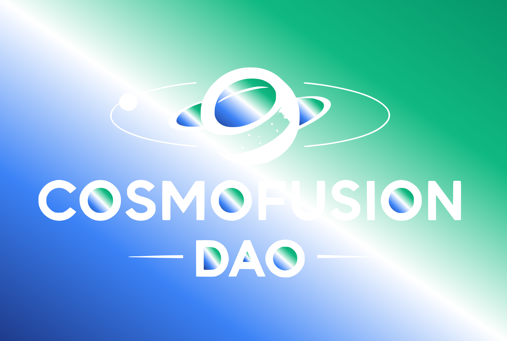
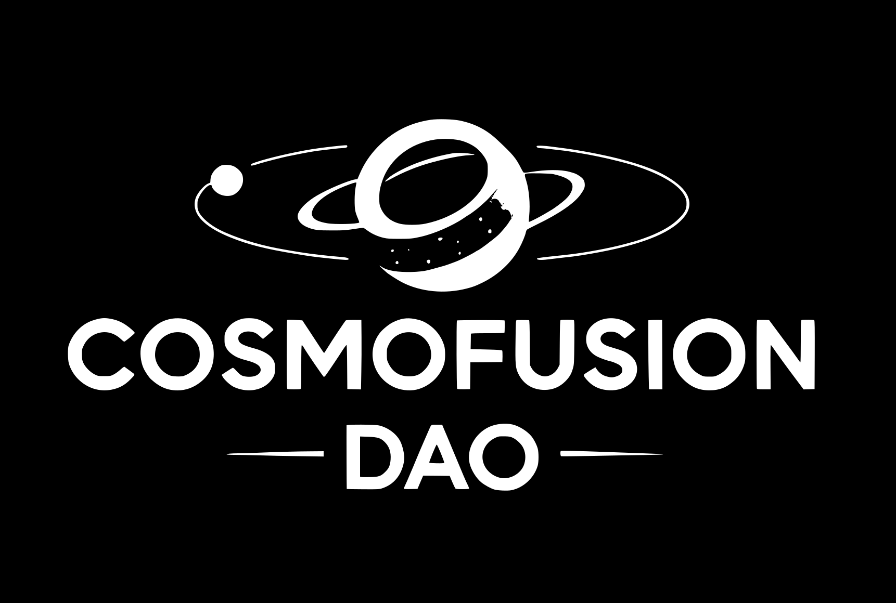

# Логотипы COSMOFUSION DAO

Этот каталог содержит различные версии логотипа COSMOFUSION DAO в формате SVG и PNG.

## Доступные версии

### SVG версии

1. **logo-original.svg** - Оригинальная версия логотипа с градиентом на элементах
2. **logo-simple.svg** - Упрощенная версия с основными элементами и градиентом
3. **logo-animated.svg** - Анимированная версия с градиентом и эффектом масштабирования

### PNG версии

Все PNG файлы созданы из SVG версий и доступны в следующих размерах:
- 16x16 px
- 32x32 px  
- 64x64 px
- 128x128 px
- 256x256 px
- 512x512 px

## Цветовая схема

Все логотипы используют градиент **синий-голубой-белый-зеленый** только на элементах логотипа:
- **Темно-синий**: #1E3A8A (начальная точка)
- **Голубой**: #3B82F6 (25%)
- **Белый**: #FFFFFF (50%)
- **Зеленый**: #10B981 (75%)
- **Темно-зеленый**: #059669 (конечная точка)

**Фон**: Прозрачный (без градиентного фона)

Градиент применяется по диагонали от левого верхнего угла к правому нижнему только к элементам логотипа (тексту и фигурам).

## Технические характеристики

### SVG файлы
- **ViewBox**: 0 0 1722 1160
- **Размеры**: 1722pt x 1160pt
- **Формат**: Векторная графика
- **Прозрачность**: Поддерживается прозрачный фон
- **Масштабируемость**: Без потери качества

### PNG файлы
- **Формат**: Растровая графика
- **Прозрачность**: Поддерживается
- **Оптимизация**: Оптимизированы для веб-использования

## Использование

### Веб-приложения
```html
<!-- Оригинальная версия -->


<!-- Анимированная версия -->


<!-- Упрощенная версия -->

```

### React компоненты
```jsx
import { ReactComponent as Logo } from './logo-original.svg';

function Header() {
  return (
    <header>
      <Logo className="logo" />
    </header>
  );
}
```

### CSS стилизация
```css
.logo {
  width: 200px;
  height: auto;
  filter: drop-shadow(0 4px 8px rgba(0,0,0,0.1));
}

/* Для анимированной версии */
.animated-logo {
  width: 200px;
  height: auto;
  animation: pulse 2s infinite;
}
```

## Генерация PNG файлов

Для создания PNG версий используется команда:

```bash
make logos-png
```

Эта команда создаст PNG файлы всех размеров из SVG источников.

## Структура файлов

```
assets/logos/
├── logo-original.svg      # Оригинальная версия с градиентом на элементах
├── logo-simple.svg        # Упрощенная версия с градиентом на элементах
├── logo-animated.svg      # Анимированная версия с градиентом на элементах
├── logo-16.png           # PNG 16x16
├── logo-32.png           # PNG 32x32
├── logo-64.png           # PNG 64x64
├── logo-128.png          # PNG 128x128
├── logo-256.png          # PNG 256x256
├── logo-512.png          # PNG 512x512
└── README.md             # Этот файл
```

## Рекомендации по использованию

1. **Для веб-сайтов**: Используйте SVG версии для лучшего качества
2. **Для мобильных приложений**: PNG версии подходящего размера
3. **Для печати**: SVG или PNG высокого разрешения
4. **Для анимации**: Используйте logo-animated.svg
5. **Для маленьких размеров**: Используйте logo-simple.svg

## Градиентные эффекты

Все логотипы используют линейный градиент только на элементах логотипа, создавая современный и привлекательный вид:

- **Начальная точка**: Темно-синий (#1E3A8A)
- **25%**: Голубой (#3B82F6)
- **50%**: Белый (#FFFFFF) 
- **75%**: Зеленый (#10B981)
- **Конечная точка**: Темно-зеленый (#059669)

Градиент применяется по диагонали только к элементам логотипа (тексту и фигурам), фон остается прозрачным. Это создает динамичный и современный эффект, соответствующий космической тематике проекта. 